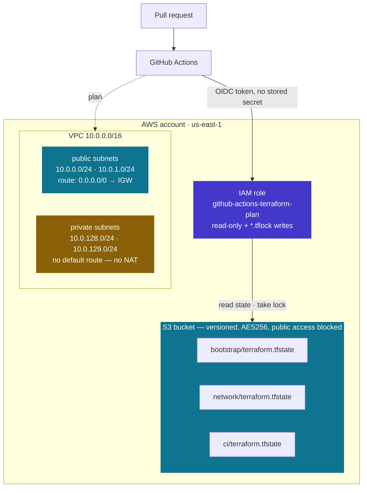
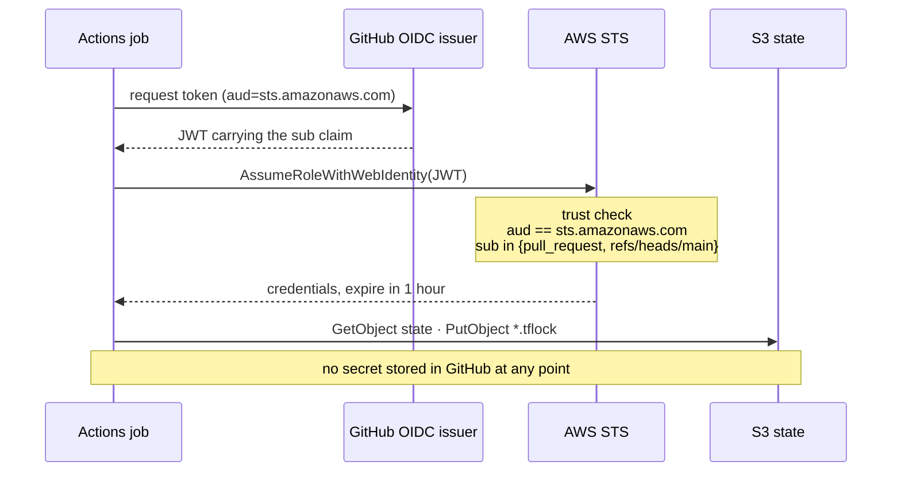

# tf-platform-lab

[](https://github.com/J-xy/tf-platform-lab/actions/workflows/terraform.yml)
[](LICENSE)

Building a Terraform platform workflow from an empty AWS account up to
policy-gated CI — one stage at a time, with every non-obvious decision written
down and defended rather than copied from a tutorial.

**All five stages are complete and applied against real AWS infrastructure.**
The status table is honest; nothing here is claimed as built before it is.

Every pull request must pass `fmt`, `tflint`, Trivy, and a `terraform plan`
against all three stacks before it can merge. `main` takes no direct pushes,
including from the repository owner.

---

## What it looks like



One bucket holds every stack's state under a separate key. The lock is a
conditional `PutObject` on a per-key `.tflock` object, so two stacks never
block each other — proven by running concurrent applies against two keys.

---

## The five stages

| Stage | Scope | What it demonstrates | Status |
|-------|-------|----------------------|--------|
| **1. Remote state backend** | S3 bucket + S3-native locking, applied with local state, then migrated into itself | Solving the bootstrap chicken-and-egg; state durability and locking as a designed property, not a default | ✅ **Done** |
| **2. Network stack** | Two-AZ VPC, public/private tiers, second key in the same bucket | That the backend works as shared infrastructure — per-key locking, multiple states in one bucket | ✅ **Done** |
| **3. CI gate** | `fmt` / `validate` / `plan` on every PR, authenticated by OIDC | Terraform treated as reviewed code, with CI holding no long-lived credentials | ✅ **Done** |
| **4. Policy as code** | `tflint` + Trivy blocking merge on violations | Guardrails enforced by machine at review time — and the judgement to tell a real finding from a rule that does not fit | ✅ **Done** |
| **5. Drift detection** | Scheduled `plan` against real infrastructure, raising an issue on divergence | That the gate has a blind spot: reviews catch what arrives through PRs, nothing catches the console | ✅ **Done** |

Branch protection requiring a pull request is already enabled on `main`. It is
overkill for a solo repo today, and it is deliberate: Stage 3's CI gate is only
meaningful if merges genuinely flow through PRs, so the habit is set before the
tooling that depends on it.

---

## Stage 1 — what was actually built

The classic bootstrap problem: Terraform wants remote state, but the remote
state backend is itself infrastructure. `bootstrap/` resolves it by applying
with **local state**, then running `init -migrate-state` to move its own state
into the bucket it just created.

Six resources in `us-east-1`:

- **S3 bucket** — name composed at plan time from caller-identity account ID and
  region, since S3 names are globally unique
- **Versioning** — the recovery path for a corrupted or truncated state write
- **Server-side encryption** — SSE-S3 (AES256)
- **Public access block** — all four booleans
- **Lifecycle rules** — bounds otherwise-unlimited version growth
- **DynamoDB lock table** — created, then made redundant by Stage 1's own
  findings (see below)

State now lives at `s3://tf-state-<account>-us-east-1/bootstrap/terraform.tfstate`.

---

## Stage 2 — what was actually built

A two-AZ VPC in `us-east-1`, applied from `network/terraform.tfstate` — a
different key in the *same* bucket Stage 1 created. 13 resources, none of which
bills by the hour:

| | |
|---|---|
| VPC | `10.0.0.0/16`, DNS support and hostnames on |
| Public subnets | `10.0.0.0/24`, `10.0.1.0/24` — auto-assign public IP |
| Private subnets | `10.0.128.0/24`, `10.0.129.0/24` — no egress |
| Internet gateway | one, routed from the public table |
| Route tables | one shared public, one private **per AZ** |
| Associations | four, explicit |

**One public route table, one private per AZ.** Every public subnet wants the
identical default route, so a second copy is duplication. Private tables are
split per AZ because a NAT gateway is a per-AZ resource — adding one later means
each AZ's private subnet routes to the NAT in its own zone. Splitting now is
free; splitting later means recreating routing.

**Subnets keyed by AZ, not index.** `for_each` over a map produces
`aws_subnet.public["us-east-1a"]`. Under `count`, removing one AZ renumbers
every subnet after it and Terraform destroys and recreates them.

**Nothing marks a subnet private.** There is no such flag. The tiers differ in
exactly one way: the public route table carries `0.0.0.0/0 → igw` and the
private tables do not. That single route is the entire boundary.

**AZs are discovered, not hardcoded.** `data.aws_availability_zones` filtered to
`available`, because AZ *names* are per-account aliases over different physical
zones — `us-east-1a` is not the same hardware in two accounts.

### What Stage 2 proves about Stage 1

Two applies run concurrently — one against `bootstrap/`, one against `network/` —
both completed with zero lock contention. Two applies against the *same* key
collide with HTTP 412. The lock is per key, not per bucket, which is what makes
one bucket safe to share across every stack in the lab.

---

## Stage 3 — what was actually built

A GitHub Actions workflow that gates every pull request, and the AWS identity it
uses. **No credentials are stored in GitHub.** Actions mints a short-lived OIDC
token per run and trades it for an AWS role via `sts:AssumeRoleWithWebIdentity`,
so there is no key to leak, rotate, or revoke.

`ci/` — 5 IAM resources, free:

| | |
|---|---|
| OIDC provider | `token.actions.githubusercontent.com`, audience `sts.amazonaws.com` |
| Role | `github-actions-terraform-plan`, 1-hour max session |
| Policies | AWS `ReadOnlyAccess` + a scoped state-access policy |



`.github/workflows/terraform.yml` — three jobs:

1. **`fmt`** — `terraform fmt -check -recursive`. No AWS credentials at all, so
   a formatting failure costs seconds and never assumes a role.
2. **`policy`** — tflint and Trivy. Also credential-free (see Stage 4).
3. **`plan`** — a matrix across `bootstrap`, `network`, and `ci`, each running
   `init` / `validate` / `plan`, with the result written to the job summary.

**The trust policy is the security boundary.** It permits exactly two subjects:

```
repo:J-xy/tf-platform-lab:pull_request
repo:J-xy/tf-platform-lab:ref:refs/heads/main
```

The common mistake is `repo:owner/name:*`, which lets *any* ref in the repo
assume the role — including a branch anyone with write access pushes. The `aud`
condition matters equally: without it the role would trust tokens minted for a
different audience.

**Read-only, except for locks.** A plan takes a state lock like any other
operation — skip it with `-lock=false` and a plan running during an apply reads
half-written state and reports a diff that never existed. So instead of
disabling locking, the role's write grant is scoped by ARN suffix to
`*.tflock`: it can create and delete lock objects and cannot touch a state file
even by accident.

**No `thumbprint_list`.** It was once required and had to be hand-updated
whenever GitHub rotated its intermediate CA. AWS now validates this provider's
certificates natively, so pinning one buys nothing and guarantees a future
outage.

Known limitation: pull requests from forks receive no OIDC token, so the plan
job fails for outside contributors by design.

---

## Stage 4 — what was actually built

Two scanners in CI, in a job that needs no AWS credentials because they read
HCL rather than live infrastructure:

- **tflint** — Terraform and provider linting: deprecated syntax, invalid
  arguments, wrong instance types. Clean across all three stacks.
- **Trivy** (`config` scan) — security misconfiguration policy.

**Not tfsec, and not checkov.** tfsec is in maintenance mode — Aqua's own
README directs users to Trivy, which inherited its scanning engine. Checkov
overlaps with Trivy by roughly 80%; running both is tool-collecting, not
defence in depth.

### The findings, and what was done with each

The first scan returned three. None was fixed blindly:

| Finding | Resolution |
|---|---|
| S3 not using customer-managed KMS keys | **Suppressed, with justification** |
| DynamoDB point-in-time recovery disabled | **Fixed by deleting the table** |
| VPC flow logs not enabled | **Deferred, with an expiry date** |

**The KMS suppression is the point of this stage.** The rule is correct in
general and wrong here: this is the bootstrap state bucket, so SSE-KMS would
require `kms:Decrypt` for every principal running a plan and would make the key
a dependency that must exist before any state does — a second bootstrap problem
inside the first. That reasoning is written into `.trivyignore.yaml`, not
buried in a commit message.

**The DynamoDB finding was fixed by deletion, not hardening.** The lock table
had been dead since `use_lockfile` replaced it in Stage 1. Enabling
point-in-time recovery would have satisfied the scanner while paying to protect
a table nothing reads. The scan is what finally surfaced infrastructure that
had quietly outlived its purpose.

**The flow logs deferral carries `expiredAt`.** Flow logs bill on ingested
volume and this lab is deliberately at zero hourly cost — but the suppression
expires, so the finding returns rather than becoming permanent.

A clean scan usually means nobody scanned anything interesting. What matters is
that every exception has a name on it and a reason a reviewer can argue with.

---

## Stage 5 — what was actually built

Stages 3 and 4 gate what arrives through pull requests. **Neither sees a change
made in the console**, by another tool, or by someone working around the
process at 2am. That is the blind spot this closes.

`.github/workflows/drift.yml` runs daily and on demand:

- `terraform plan -detailed-exitcode` across all three stacks — exit `0` means
  reality matches, `2` means it does not, `1` is a genuine error, and the three
  are handled differently
- Every stack is checked even after one drifts, so the report is complete
  rather than stopping at the first difference
- On divergence it opens an issue labelled `drift`, with each stack's plan
  output in a collapsible block
- **One issue, reused.** Subsequent runs comment rather than opening a new
  issue — a fresh issue per day buries the signal within a week, which is how
  drift alerting usually dies
- **It closes the issue when the drift is resolved.** An alert that never
  clears is an alert people learn to ignore

No IAM change was needed. A scheduled run's OIDC subject is
`ref:refs/heads/main`, which the Stage 3 trust policy already permits, and
`plan` needs no permission the role does not already hold.

### Verified by causing real drift

The mechanism was tested by changing infrastructure out of band — adding a tag
to the VPC with the AWS CLI, exactly as someone would in the console:

```
$ aws ec2 create-tags --resources vpc-… --tags Key=drift-test,Value=changed-in-console
$ terraform -chdir=network plan -detailed-exitcode
  # aws_vpc.main will be updated in-place
      ~ tags = { - "drift-test" = "changed-in-console" -> null }
  exit code: 2
```

Then reverted with `apply`, returning the exit code to `0`. A drift detector
that has never seen drift is an untested assumption.

---

## Decisions, and the argument for each

The point of the lab is the reasoning, not the resource count.

**SSE-S3 over SSE-KMS.** KMS would require every principal running a plan to
hold `kms:Decrypt` on the key, and the key itself becomes another dependency
that must exist before state does — a second chicken-and-egg inside the first.
SSE-S3 has no key policy to manage and no additional cost. KMS earns its
complexity when you need an audit trail of decrypt calls or independent key
rotation; a bootstrap bucket needs neither.

**`prevent_destroy` on the bucket.** This bucket holds the state for every other
stack, so losing it means losing the record of what exists. The lifecycle guard
makes `terraform destroy` refuse until it is deliberately removed. That friction
is the feature.

**Composed bucket name over a hardcoded one.** `data.aws_caller_identity` +
region rather than `random_id`: it is deterministic, produces no diff on
re-apply, needs no extra provider, and — critically — can be re-derived from
nothing if state is ever lost before migration. A `random_id` suffix lives only
in state, which is precisely the thing you cannot rely on during a bootstrap.

**S3-native locking, no DynamoDB.** The lab created the lock table first, then a
deliberate contention test showed what actually refuses a concurrent apply:

```
Error: Error acquiring the state lock
  operation error S3: PutObject … StatusCode: 412
  api error PreconditionFailed
  ID:        01e86e89-a39b-46cb-d0fb-095d43f289e1
  Who:       jack@Mac-2641.lan
  Created:   2026-09-03 05:27:10 UTC
```

That 412 is `use_lockfile` — an atomic conditional `PutObject`, one API call, no
second service. DynamoDB existed to provide locking *before* S3 supported
conditional writes; `dynamodb_table` is deprecated on Terraform 1.11+. It was
dropped, and locking was re-tested afterward to confirm the guarantee survived
the change. Most bootstrap guides still tell you to create that table.

**Two lifecycle rules, not one.** AWS rejects `ExpiredObjectDeleteMarker` in an
expiration block that also carries day- or date-based conditions, so the
noncurrent-version rule and the delete-marker rule must be separate. The
expiry thresholds (30 days *and* 10 newer versions, ANDed) are deliberately
conservative: those noncurrent versions *are* the disaster-recovery story, and
expiring them aggressively would discard the property versioning exists to give.

The need was measured rather than assumed — after a handful of operations the
bucket already held 5 noncurrent versions and 3 delete markers, because every
lock cycle leaves both behind.

---

## Verification

Every claim above was checked against the AWS API rather than against
Terraform's own report of success:

| Check | Method |
|---|---|
| Encryption, versioning, public access block, tags | `aws s3api get-*` |
| Lock table schema and billing mode | `aws dynamodb describe-table` |
| Locking genuinely refuses concurrent applies | Two racing applies; caught the `.tflock` mid-flight |
| Lifecycle rules idempotent | Re-plan immediately after apply reports no changes |
| State survived backend changes | `state list` + `plan` after `init -reconfigure` |

---

## Layout

```
bootstrap/        Stage 1 — the state backend, applied with local state
  versions.tf     Terraform + provider constraints
  providers.tf    AWS provider, default_tags (owner / project / managed-by)
  main.tf         All six resources
  outputs.tf      Bucket, table, region — consumed by later stages
  backend.tf      S3 backend; added only after the first successful apply
network/          Stage 2 — VPC, same bucket, key network/terraform.tfstate
  main.tf         VPC, subnets, IGW, route tables, associations
  variables.tf    vpc_cidr, az_count, name_prefix — with validation blocks
  outputs.tf      VPC and subnet handles for later stages
ci/               Stage 3 — GitHub OIDC provider and the CI role
  main.tf         OIDC provider, role, trust policy, scoped state access
.github/workflows/
  terraform.yml   fmt gate, then plan across all three stacks
CLAUDE.md         Working notes and operational gotchas
```

## Running it

```bash
cd bootstrap
terraform init
terraform plan      # free; requires AWS credentials
terraform apply     # creates billable resources (a few cents/year at this scale)
```

Credentials are IAM Identity Center (SSO) rather than long-lived access keys —
short-lived, expiring, nothing static written to disk.

---

## Tearing it down

Order matters, and the last stack fights back on purpose. `bootstrap/` holds the
state for everything else and carries `prevent_destroy`, so a naive
`terraform destroy` at the top level fails — by design, since that bucket is the
only record of what exists.

**1. Destroy the dependent stacks first.** Their state lives in the bootstrap
bucket, which must still exist while they are torn down.

```bash
terraform -chdir=network destroy
terraform -chdir=ci destroy      # removes the CI role — CI stops working from here
```

**2. Disarm the bootstrap bucket.** Two edits to `bootstrap/main.tf`, then apply
so the change reaches state:

```hcl
resource "aws_s3_bucket" "state" {
  bucket        = local.state_bucket_name
  force_destroy = true          # add: the bucket holds state objects and their
                                # versions, and DeleteBucket fails on a bucket
                                # that is not empty

  lifecycle {
    # prevent_destroy = true    # remove: this is what refuses the destroy
  }
}
```

```bash
terraform -chdir=bootstrap apply
```

**3. Bring state back to local before deleting the bucket it lives in.** This is
the step people miss. Destroying the bucket while Terraform's state is inside it
means the final state write goes to a bucket that no longer exists.

```bash
mv bootstrap/backend.tf bootstrap/backend.tf.disabled
terraform -chdir=bootstrap init -migrate-state    # answer yes; copies S3 -> local
```

**4. Now destroy it.**

```bash
terraform -chdir=bootstrap destroy
```

`force_destroy` empties the bucket first, including every noncurrent version and
delete marker the lifecycle rules had not yet expired.

### What Terraform does not clean up

These were created by hand and have to be removed by hand:

| Thing | Where |
|---|---|
| IAM Identity Center instance, user, permission set | IAM Identity Center console |
| The `~/.aws/config` SSO profile | Local machine |
| Branch protection and required checks | Repository settings |

### If you would rather not

Leaving the lab running costs approximately nothing — an S3 bucket holding a few
KB and an IAM role. There is no NAT gateway, no EC2, no load balancer, nothing
billed by the hour. The reason to tear it down is tidiness, not cost.

---

## Not getting charged

Teardown above is the wrong tool for this. It removes what you already know
about, in the region you thought to look at — but a surprise bill comes from the
resource you forgot, somewhere you did not check.

`scripts/cost-sentinel.sh` sweeps **every** region for resources that bill by
the hour, and deletes nothing:

| Checked | Rough cost |
|---|---|
| NAT gateways | $32/mo each |
| Running EC2 instances | $8–250/mo each |
| Elastic IPs | $3.60/mo each |
| Load balancers | $16–22/mo each |
| RDS instances | $13–200/mo each |
| Unattached EBS volumes | $0.08/GB/mo |
| VPC interface endpoints | $7/mo each |
| EKS clusters | $73/mo each |

```bash
./scripts/cost-sentinel.sh     # exit 1 if anything billable exists
```

It also runs daily as `.github/workflows/cost-sentinel.yml`, opening an issue
labelled `cost` when it finds something and closing it once the account is clean.

**A denial is reported as unknown, never as clean.** Run it as a human and
several checks fail: the SSO permission set is deliberately narrower than the CI
role, which carries `ReadOnlyAccess`. A sweep that silently skipped what it
could not see would be worse than no sweep, so it names the checks that did not
run and refuses to call the account clean.

None of this replaces a **budget alert** — Billing → Budgets → Create budget.
The sentinel finds what exists; a budget catches everything, including what
neither the script nor Terraform knows about.

---

## License

MIT — see [LICENSE](LICENSE).
