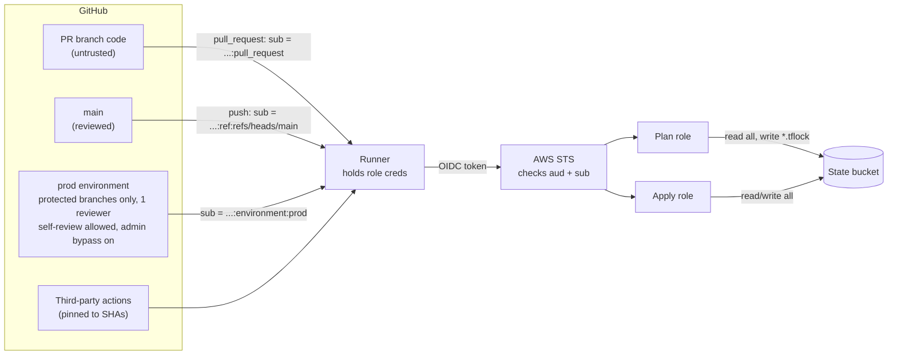

# CI threat model: tf-platform-lab

Status: draft for review, 2026-10-06.
Scope: the GitHub Actions to AWS path in `.github/workflows/` and `ci/`. Not in scope: the AWS resources Terraform manages, and the maintainer's laptop and SSO session.

How to read this: claims marked **[repo]** were checked against a file in this repo, with the location. Claims marked **[tested]** were demonstrated in `docs/oidc-negative-tests.md`. Claims marked **[verify]** depend on GitHub settings that are not visible from the code.

## 1. Assets

| Asset | Where | Why it matters |
| --- | --- | --- |
| Terraform state | `s3://tf-state-964291633585-us-east-1`, SSE-S3, versioned | Holds every attribute of every managed resource. Terraform writes sensitive values into state in plaintext. Losing it, or reading it, are both serious. |
| Apply role | `github-actions-terraform-apply` | Can create and change infrastructure, including IAM. The most valuable credential in the pipeline. |
| Plan role | `github-actions-terraform-plan` | Account-wide `ViewOnlyAccess`, read on every object in the state bucket, and write on `*.tflock` objects. Lower value than apply, but not harmless (see F1 and T5). |
| Runner | GitHub-hosted `ubuntu-latest` | Holds role credentials in its environment for the life of a job. Has open outbound network access. |
| Workflow files | `.github/workflows/*.yml` | They decide what runs with which role. Whoever edits them on a branch controls the job. |
| OIDC trust policies | `ci/main.tf`, `ci/tf_apply.tf` | The only thing AWS checks before issuing credentials. |

## 2. Trust boundaries

The boundaries that matter:

1. **Branch code to runner.** Code from an unreviewed branch executes on a runner that holds credentials. Nothing in the trust policy distinguishes it from reviewed code.
2. **Runner to STS.** STS checks `aud` and an exact `sub` match. It does not see the workflow file, the branch name (for PRs), or what the job is about to run. **[tested]** A branch push, and a job claiming `environment: prod` from a branch, are both refused.
3. **GitHub settings to AWS.** The apply role's `sub` has no branch in it. The `prod` environment's branch rule and required reviewer are half the control, and AWS cannot see them. **[tested]**

## 3. Findings from this repo

### F1. `plan` runs pull-request code with role credentials

**Evidence [repo].** `terraform.yml` triggers on `pull_request` (lines 5-8). The `plan` job checks out the PR's code, assumes the plan role (lines 126-131), and only then runs `terraform init`, `validate` and `plan` (lines 133-154). `configure-aws-credentials` exports `AWS_ACCESS_KEY_ID`, `AWS_SECRET_ACCESS_KEY` and `AWS_SESSION_TOKEN` into the environment of every later step.

**Mechanism.** Terraform executes code supplied by the configuration during `plan`:

- A `data "external"` block runs an arbitrary program on every plan.
- A `required_providers` entry can name any provider. `terraform init` downloads it and `plan` runs its binary. The PR also controls `.terraform.lock.hcl`, so the lock file does not protect against this.

Either gets code execution on a runner whose environment holds plan-role credentials. (Provisioners and `local-exec` run at apply, not plan, so they are not part of this finding.)

**What the attacker reaches.** `ViewOnlyAccess` metadata across the account, the full contents of every state file, and write access to lock objects. The repo is public **[verified 2026-10-09]**, so Actions logs are world-readable, which gives an attacker an exfiltration channel with no outbound network needed.

**Not covered by the above.** Fork PRs. For `pull_request` from a fork I expect GitHub withholds the OIDC token. **[verify]** by opening a PR from a fork and checking that the assume step fails.

### F2. Anyone who can push a branch can edit the workflow and borrow the plan role

**Evidence [repo].** The plan role's trust policy accepts `repo:J-xy@68347443/tf-platform-lab@1355558109:pull_request` (`ci/main.tf`, `data.aws_iam_policy_document.trust`). That subject is identical for every pull request in the repo. A `pull_request` run uses the workflow file from the PR's merge commit, so the PR author decides what the job does.

**Mechanism.** A branch that edits `terraform.yml`, or adds a new workflow file triggered on `pull_request`, mints a token with the allowed subject and assumes the plan role. No existing workflow code is needed. **[tested, partially]** The negative suite showed a *push* to a feature branch is refused. It did not run the other half of the test: a *pull request* from the same branch should succeed. Run it to close the finding (section 6).

**Who this applies to.** Anyone with write access to the repo, a stolen maintainer token or PAT, or a compromised maintainer account. For a single-maintainer repo the realistic route is credential theft, not a rogue collaborator.

## 4. Threats

Each threat lists what is in place, the recommended change, what risk remains after it, and what would detect an attempt.

### T1. Untrusted code executes during plan (F1)

| | |
| --- | --- |
| In place | Plan role is read-only apart from lock objects. Workflow default is `contents: read` with no `id-token`; only the `plan` and `apply` jobs request a token **[repo]**. 1-hour max session **[repo]**. |
| Recommended | (a) Stop running credentialed plan on unreviewed branches: run `fmt`, `validate`, `trivy` and `terraform test` on PRs (all credential-free today **[repo]**) and run the credentialed plan on push to main, or behind an approval environment. (b) In the credential-free `policy` job, fail the PR if it adds `data "external"`, a new `required_providers` source, or changes `.terraform.lock.hcl`. (c) CODEOWNERS on `.github/`, `**/versions.tf` and the lock files. |
| Residual | Option (a) removes pre-merge plan output from reviews, which is a real loss. A review gate that only catches known patterns misses new ones. CODEOWNERS adds nothing on a one-person repo, because the maintainer approves their own changes. |
| Detection | A PR touching `versions.tf`, a lock file, or `.github/` (GitHub audit log and PR file list). CloudTrail: a successful plan-role assume whose `sub` is `:pull_request` followed by S3 reads on state objects outside the usual pattern (requires data events, see T5). |

### T2. Branch pusher borrows the plan role (F2)

| | |
| --- | --- |
| In place | Immutable `sub` with owner and repo IDs, `StringEquals`, no wildcards **[repo]**. Only three subjects are trusted across both roles **[tested]**. |
| Recommended | Reduce what the plan role is worth, because the trust policy cannot separate reviewed from unreviewed workflow code on PRs. Concretely: see T5. Optionally require approval for PR plans by moving them into a `plan` environment, which changes the subject to `:environment:plan` and lets you add a reviewer. |
| Residual | A write-access holder can always run code as the plan role while the `:pull_request` subject is trusted. The remaining defence is the role's limited permissions. |
| Detection | CloudTrail `AssumeRoleWithWebIdentity` from `:pull_request` subjects, compared against GitHub's list of PRs for the same time window. In the events pulled during testing, the only token claim visible was `sub` (inside `principalId`), so job-level attribution needs GitHub's run list, not CloudTrail. |

### T3. Compromised third-party action

| | |
| --- | --- |
| In place | Every action pinned to a full commit SHA **[repo]**. Dependabot opens PRs for updates **[repo]**. `policy` and `test` jobs hold no credentials **[repo]**. |
| Recommended | Treat `configure-aws-credentials` and `setup-terraform` as the highest-risk actions, because they run in credentialed jobs. Review Dependabot's diff, not just its changelog, before merging (PRs #16-18 are major version bumps). |
| Residual | A pinned SHA protects against a moved tag, not against a malicious commit that was already pinned when you adopted it. Any action in a credentialed job can read the credentials. |
| Detection | Dependabot and GitHub's advisory feed for the pinned actions. Unexpected outbound connections from a runner are not visible with GitHub-hosted runners unless you add an egress-monitoring step. |

### T4. Over-broad OIDC subject

| | |
| --- | --- |
| In place | `StringEquals` on `aud` and `sub`; `sub` pins numeric owner and repo IDs, so a renamed or transferred repo cannot be claimed by a new owner **[repo, tested]**. The apply subject is the single value `:environment:prod`. |
| Recommended | Keep it exact. Add a CI check on `ci/` that fails if a trust policy ever contains `StringLike`, `*`, or a subject without `@<id>`. |
| Residual | `:pull_request` is broad by nature (see T2). The apply subject depends on the `prod` environment settings, which are not in code **[verify]**. |
| Detection | `AccessDenied` bursts on `AssumeRoleWithWebIdentity` with a `sub` outside the three legitimate values **[tested]**. Key the alert on `principalId`: `requestParameters.roleArn` was null on every denied event we captured. Expect many events per attempt, because `configure-aws-credentials` retries. |

### T5. State exfiltration

| | |
| --- | --- |
| In place | Bucket is private with public access blocked, versioned, SSE-S3 **[repo]**. The plan role cannot write state objects, only `*.tflock` **[repo]**. |
| Recommended | The plan role has `s3:GetObject` on `bucket/*`, so a plan job can read every stack's state **[repo]**. Narrow it to the state keys each stack actually needs, or accept it consciously. Enable S3 **data events** for this bucket in CloudTrail. Treat secrets as out of state where possible (generated values via a secrets manager, not Terraform attributes). Switch to SSE-KMS if you need decrypt-level audit. |
| Residual | `plan` must read state, so the plan role can never be fully blind to it. Data events cost money and add volume. |
| Detection | Today, none. S3 object reads are data events, which a default trail does not record, so reads of state by the plan role are invisible. With data events on: alert on `GetObject` against the state bucket by a plan-role session outside a normal run window. |

### T6. Apply role can escalate and persist (found while writing)

`tf_apply.tf` allows `CreatePolicy`/`CreatePolicyVersion` on `tf-platform-lab-*`, `AttachRolePolicy` on `github-actions-terraform-*` (with a policy-ARN condition), and `UpdateAssumeRolePolicy` on `github-actions-terraform-*`. That prefix includes the apply role itself, so a job running as apply can write a policy with any content, or edit a trust policy to admit another subject. The file records the first as an accepted risk. The second is not recorded.
Mitigation: a permissions boundary on both CI roles, and an SCP or boundary condition denying `iam:UpdateAssumeRolePolicy` on the apply role. Residual: a role that manages IAM cannot be fully stopped from escalating without a boundary. Detection: CloudTrail `UpdateAssumeRolePolicy` and `CreatePolicyVersion` events by the apply role's sessions, alerting on any change not matching a merged `ci/` diff.

### T7. The approval is not bound to what gets applied (found while writing)

The `apply` job runs a fresh `terraform apply -auto-approve` after the reviewer approves **[repo]**. It does not apply the plan from the `plan` job. If state or config changes between the plan the reviewer read and the apply step running, the reviewer approved something different. Mitigation: `terraform plan -out`, upload the file as a short-retention artifact, and `terraform apply` that file. Residual: plan files can contain secrets, so retention must be short. Detection: compare the applied resource changes in CloudTrail to the plan summary for the same run.

### T8. Lock tampering by the plan role (found while writing)

The plan role may `PutObject` and `DeleteObject` on `*.tflock` **[repo]**. A malicious plan job can delete a lock mid-apply (allowing two writers, and state corruption), or hold one to block applies. Mitigation: bucket versioning limits the damage and noncurrent versions are kept for 30 days **[repo]**; this is a recoverability control, not a prevention. Detection: `DeleteObject` on a `.tflock` key by a plan-role session while an apply is running (needs data events, see T5).

## 5. Priority

0. Settings that take minutes and need no code: turn off `prod` admin bypass, switch `prod` to a custom branch policy for `main`, enable `sha_pinning_required`.
1. Close F1: stop credentialed plan on unreviewed branches, or gate it. Everything in T1, T2 and T5 gets smaller. The `plan` jobs are required status checks on `main`, so this needs a design (for example a credential-free plan job that satisfies the check, with the credentialed plan running post-merge) and not a deletion.
2. Turn on S3 data events for the state bucket. It is the only way to see T1, T5 and T8.
3. Bind approval to the plan (T7). Small change, directly strengthens the control the apply role relies on.
4. Add a permissions boundary to both CI roles (T6).
5. Add the credential-free policy-job checks (T1b, T4).

## 6. Verification still owed

| Check | How | Closes |
| --- | --- | --- |
| A PR (not a push) from a branch can assume the plan role | Open a PR whose branch adds a workflow with `on: pull_request` that assumes the plan role and prints `aws sts get-caller-identity`. Expect success. | F2 |
| `data "external"` executes during plan on a PR | PR adding a harmless `data "external"` that writes a marker to the job log. | F1 |
| Fork PRs cannot mint an OIDC token | PR from a fork. Expect the assume step to fail. | F1 scope |
| Repo is public and Actions logs are public | `gh repo view --json visibility`. | **Done 2026-10-09: PUBLIC.** F1 impact stands. |
| `prod` environment settings | `gh api repos/J-xy/tf-platform-lab/environments/prod`. | **Done: see "Settings results" below.** T4 gets two new residuals. |
| Branch protection and rulesets on `main` | `gh api repos/J-xy/tf-platform-lab/rulesets`. | **Done:** no rulesets; classic protection on `main`. |
| Default workflow token permissions | `gh api repos/J-xy/tf-platform-lab/actions/permissions/workflow`. | **Done:** `read`, and workflows cannot approve PRs. |
| Fork-PR approval policy | `gh api repos/J-xy/tf-platform-lab/actions/permissions/fork-pr-contributor-approval`. | Still owed. Matters because the repo is public. |

### Settings results (2026-10-09)

| Setting | Value | Effect |
| --- | --- | --- |
| `prod` deployment branches | "Protected branches" (`custom_branch_policies: false`) | The gate is "any branch with a protection rule", not "`main`". Safe today, but a new protection rule on any branch widens it. Prefer a custom policy naming `main`. |
| `prod` required reviewer | J-xy only, `prevent_self_review: false` | The approver is the same person who triggered the run. Fine for a solo repo, but it means the gate stops automation, not J. |
| `prod` admin bypass | `can_admins_bypass: true` | A stolen admin token can skip the reviewer rule. Turn off. |
| `main` protection | PR required, 0 approvals, `enforce_admins: true`, required checks `fmt`, three `plan`, `policy`, `strict: false` | The `plan` jobs are required checks, so removing credentialed plan from PRs (F1 fix) means redesigning these checks first. `strict: false` means the merged result was never planned. |
| Default token | `read`, `can_approve_pull_request_reviews: false` | Good. Workflows can't self-approve. |
| Allowed actions | `all`, `sha_pinning_required: false` | Every action in the repo is SHA-pinned today **[repo]**, but nothing enforces it. Turn on `sha_pinning_required`. |
