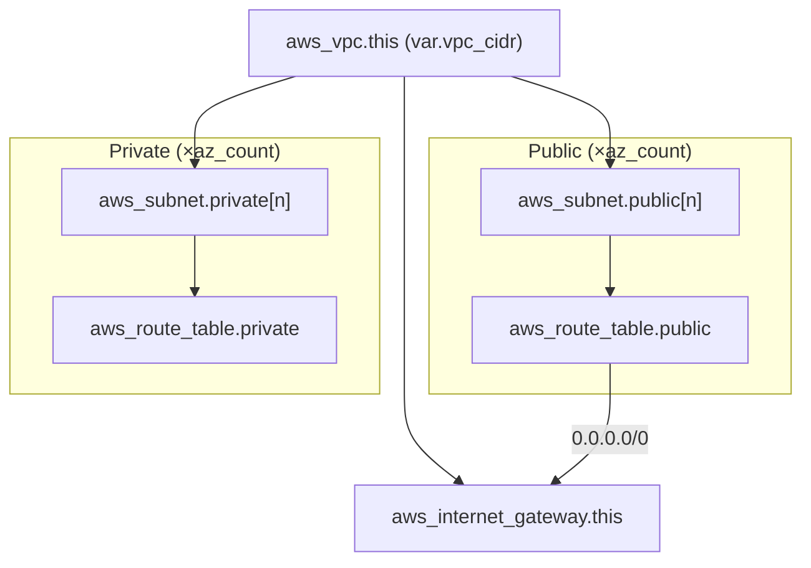

## What Stage 2 proves

*(your two sentences here)*

## Architecture



## How to consume

```hcl
module "vpc" {
  source = "git::https://github.com/<your-org>/<your-repo>.git//modules/baseline-vpc?ref=v0.1.0"

  name_prefix = "myapp-dev"
  vpc_cidr    = "10.1.0.0/16"
  az_count    = 2
  enable_nat  = false
  tags = {
    Environment = "dev"
  }
}
```

<!-- BEGIN_TF_DOCS -->
## Requirements

| Name | Version |
| ---- | ------- |
| <a name="requirement_terraform"></a> [terraform](#requirement\_terraform) | >= 1.7 |
| <a name="requirement_aws"></a> [aws](#requirement\_aws) | ~> 5.0 |

## Providers

| Name | Version |
| ---- | ------- |
| <a name="provider_aws"></a> [aws](#provider\_aws) | 5.100.0 |

## Modules

No modules.

## Resources

| Name | Type |
| ---- | ---- |
| [aws_internet_gateway.this](https://registry.terraform.io/providers/hashicorp/aws/latest/docs/resources/internet_gateway) | resource |
| [aws_route_table.private](https://registry.terraform.io/providers/hashicorp/aws/latest/docs/resources/route_table) | resource |
| [aws_route_table.public](https://registry.terraform.io/providers/hashicorp/aws/latest/docs/resources/route_table) | resource |
| [aws_route_table_association.private](https://registry.terraform.io/providers/hashicorp/aws/latest/docs/resources/route_table_association) | resource |
| [aws_route_table_association.public](https://registry.terraform.io/providers/hashicorp/aws/latest/docs/resources/route_table_association) | resource |
| [aws_subnet.private](https://registry.terraform.io/providers/hashicorp/aws/latest/docs/resources/subnet) | resource |
| [aws_subnet.public](https://registry.terraform.io/providers/hashicorp/aws/latest/docs/resources/subnet) | resource |
| [aws_vpc.this](https://registry.terraform.io/providers/hashicorp/aws/latest/docs/resources/vpc) | resource |
| [aws_availability_zones.available](https://registry.terraform.io/providers/hashicorp/aws/latest/docs/data-sources/availability_zones) | data source |

## Inputs

| Name | Description | Type | Default | Required |
| ---- | ----------- | ---- | ------- | :------: |
| <a name="input_az_count"></a> [az\_count](#input\_az\_count) | Number of availability zones to spread subnets across. | `number` | `2` | no |
| <a name="input_enable_nat"></a> [enable\_nat](#input\_enable\_nat) | Whether to provision a NAT gateway for private subnet egress. Defaults to false — NAT costs ~$0.045/hr plus per-GB processing, so it must be an explicit opt-in. | `bool` | `false` | no |
| <a name="input_name_prefix"></a> [name\_prefix](#input\_name\_prefix) | Prefix for Name tags, so resources are not all called "main". | `string` | `"tf-lab"` | no |
| <a name="input_tags"></a> [tags](#input\_tags) | Additional tags merged onto every resource. | `map(string)` | `{}` | no |
| <a name="input_vpc_cidr"></a> [vpc\_cidr](#input\_vpc\_cidr) | CIDR block for the VPC. Must be /16. | `string` | `"10.0.0.0/16"` | no |

## Outputs

| Name | Description |
| ---- | ----------- |
| <a name="output_private_route_table_ids"></a> [private\_route\_table\_ids](#output\_private\_route\_table\_ids) | Map of AZ name → private route table ID. |
| <a name="output_private_subnet_ids"></a> [private\_subnet\_ids](#output\_private\_subnet\_ids) | Map of AZ name → private subnet ID. |
| <a name="output_public_route_table_id"></a> [public\_route\_table\_id](#output\_public\_route\_table\_id) | ID of the shared public route table. |
| <a name="output_public_subnet_ids"></a> [public\_subnet\_ids](#output\_public\_subnet\_ids) | Map of AZ name → public subnet ID. |
| <a name="output_vpc_id"></a> [vpc\_id](#output\_vpc\_id) | ID of the VPC. |
<!-- END_TF_DOCS -->